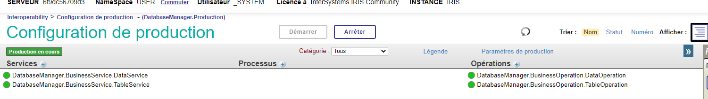
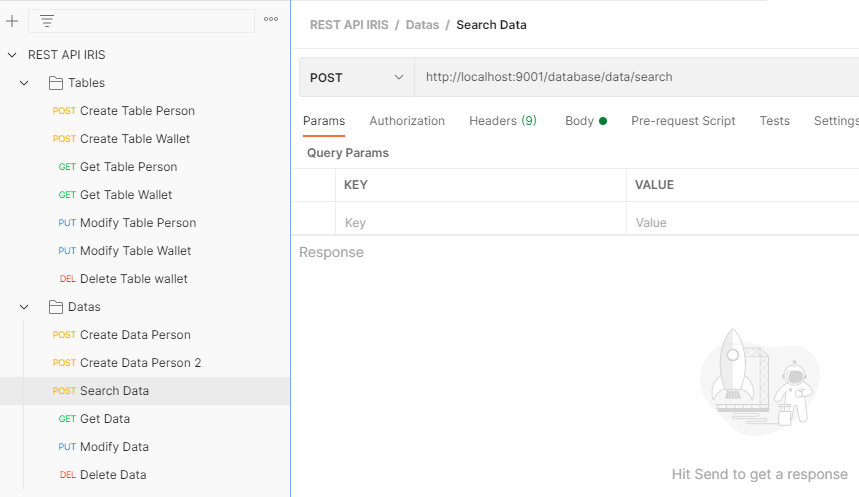
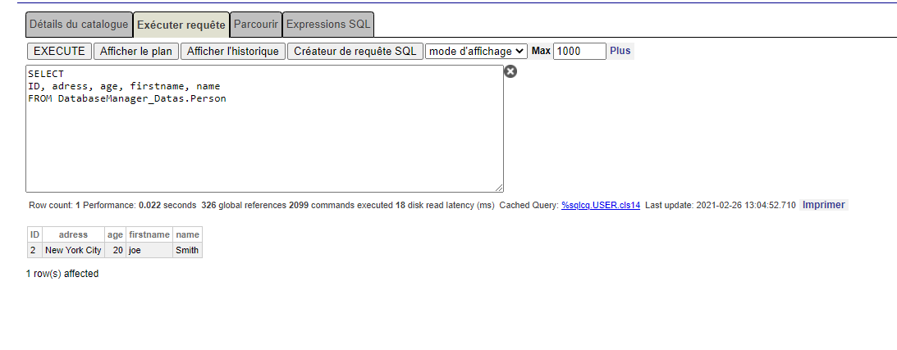

## IRIS-REST-API-DATABASEMANAGER

[](https://openexchange.intersystems.com/package/iris-rest-api-databasemanager)

Collaborator :
- Guillaume Leprêtre : [DC Profil](https://community.intersystems.com/user/guillaume-lepretre)

This application allow you to create  persistent Tables and Data in Cache Database.
It uses POST , GET , PUT and DELETE methods.

## Installation with ZPM

zpm:USER>install iris-rest-api-databasemanager

On the Administration Portal, make sure you have services and operations in the interoperabilty production such as below on USER namespace: 


 
## Installation with Docker

## Prerequisites
Make sure you have [git](https://git-scm.com/book/en/v2/Getting-Started-Installing-Git) and [Docker desktop](https://www.docker.com/products/docker-desktop) installed.

## Installation 
Clone/git pull the repo into any local directory

```
$ git clone git@github.com:LucasBourre/IRIS-Restful-API-Database.git
```

Open the terminal in this directory and run:

```
$ docker-compose build
```

3. Run the IRIS container with your project:

```
$ docker-compose up -d
```

## How to Test it

Docker default port are 9000 , 9001 and 9002.
There is a POSTMAN collection in the project in order to test the application that will allow you to create some Tables and Datas : 



Here are different types available :
String , Date , Integer (Int), Decimal, Float, TimeStamp , Boolean

Datas can be accessed from SQL Management Portal, with a prefix "DatabaseManager_Datas" : 

 
## Next Features
What we plan to add on this project:
- More possibilities for your table creation ( Cardinality , relationship between tables, maxlen on properties...)
- Send multiple datas or tables
- A prediction API to predict values
